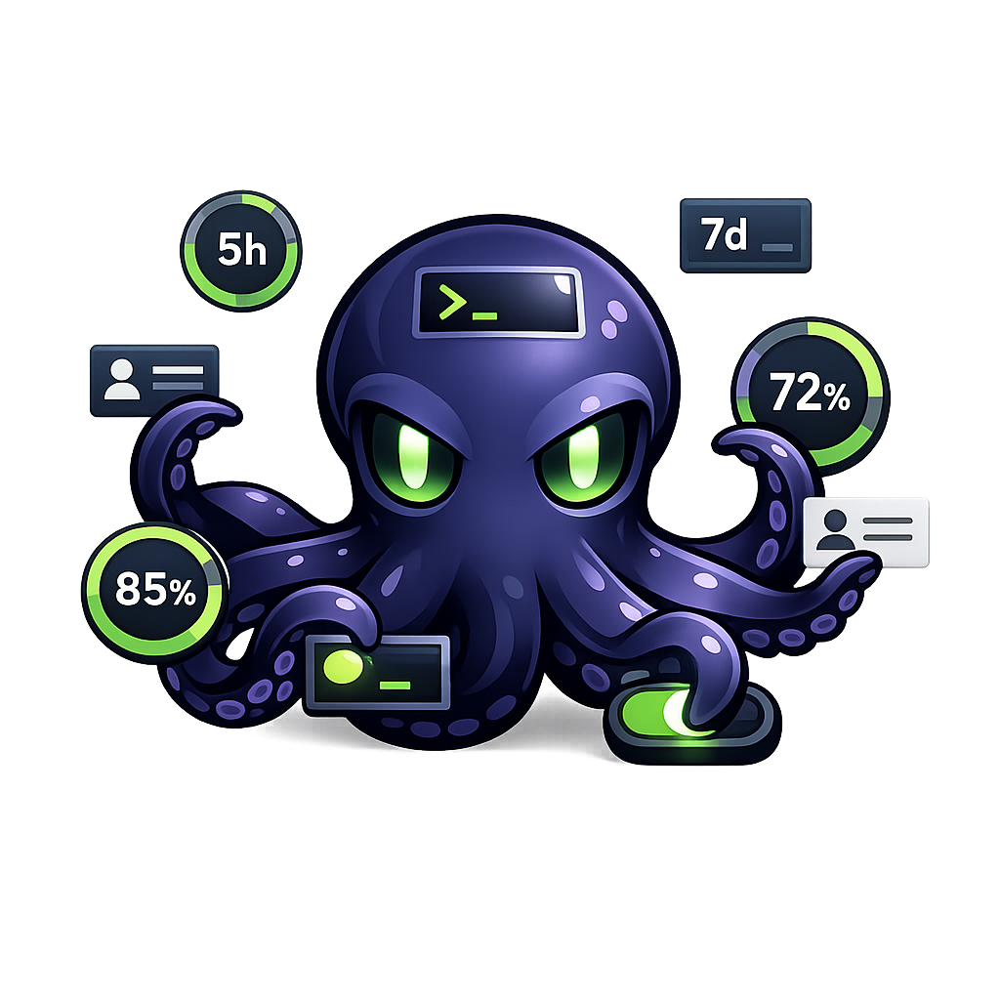

<h1 align="center">⌘ CodexCTL</h1>

<p align="center"><strong>Multi-account quota tracker for OpenAI Codex — Rust + Tauri</strong></p>

<p align="center">
  
</p>

---

## 🇪🇸 Español — ¿Para qué sirve?

Si tenés **varias cuentas de OpenAI Codex** (Plus, Team, Free) y querés:
- Ver cuánta quota te queda en **cada una** sin tener que switchear manualmente
- Saber cuál tiene **disponible** para seguir trabajando
- Cambiar de cuenta **al instante** con un solo comando
- No perder tiempo logueándote y deslogueándote cada vez

CodexCTL te muestra todo en una tabla: el porcentaje usado, el disponible, y cuándo se reinicia cada ventana (5h, 7d). Todo local, todo directo desde la API de OpenAI.

```
ID       Cuenta       Email                    Plan     5h%  Disp.  7d%  Disp.  Reinicio
team-1   Cuenta 1     hexarevenant@gmail.com    team     —    —      90%  10%    mié 05 ago 14:29
free-1   Cuenta 4     hexarevenant@gmail.com    free     100% 0%     —    —      jue 27 ago 19:22
```

## 🇬🇧 English — What is it for?

Manage **multiple OpenAI Codex accounts** (Plus, Team, Free) from a single tool:
- See **live quota** for every account at a glance
- Know which account has **available usage** right now
- **Switch accounts** instantly with one command
- No more logging in and out constantly

CodexCTL shows a table with used percentage, available percentage, and reset time for each window (5h, 7d). Everything is local, fetched directly from the OpenAI API.

```
ID       Account      Email                    Plan     5h%  Avail. 7d%  Avail. Reset
team-1   Account 1    hexarevenant@gmail.com    team     —    —      90%  10%    Wed 05 Aug 14:29
free-1   Account 4    hexarevenant@gmail.com    free     100% 0%     —    —      Thu 27 Aug 19:22
```

## 🇧🇷 Português — Para que serve?

Se você tem **várias contas do OpenAI Codex** (Plus, Team, Free) e quer:
- Ver quanto de cota resta em **cada uma** sem precisar trocar manualmente
- Saber qual tem **disponível** para continuar trabalhando
- Trocar de conta **instantaneamente** com um comando só
- Não perder tempo fazendo login e logout toda hora

O CodexCTL mostra tudo em uma tabela: a porcentagem usada, a disponível, e quando cada janela reinicia (5h, 7d). Tudo local, direto da API da OpenAI.

```
ID       Conta        Email                    Plano    5h%  Disp.  7d%  Disp.  Reinício
team-1   Conta 1      hexarevenant@gmail.com    team     —    —      90%  10%    qua 05 ago 14:29
free-1   Conta 4      hexarevenant@gmail.com    free     100% 0%     —    —      qui 27 ago 19:22
```

---

## ⚙️ Características / Features / Características

| 🇪🇸 | 🇬🇧 | 🇧🇷 |
|----|----|----|
| Quota en vivo desde la API de OpenAI | Live quota from the OpenAI API | Cota ao vivo da API da OpenAI |
| Múltiples cuentas (Plus, Team, Free) | Multiple accounts (Plus, Team, Free) | Múltiplas contas (Plus, Team, Free) |
| Switch instantáneo entre cuentas | Instant account switching | Troca instantânea entre contas |
| Refresh automático cada 5 minutos | Auto-refresh every 5 minutes | Atualização automática a cada 5 min |
| Multiplataforma (Linux, macOS, Windows) | Cross-platform (Linux, macOS, Windows) | Multiplataforma (Linux, macOS, Windows) |
| Hecho en Rust — binario único | Built in Rust — single binary | Feito em Rust — binário único |

---

## 💾 Instalación / Installation / Instalação

### 🐧 Linux

```bash
# AppImage (recomendado — portable, 0 dependencias)
chmod +x codexctl_0.1.0_amd64.AppImage
./codexctl_0.1.0_amd64.AppImage

# .deb (Debian/Ubuntu)
sudo dpkg -i codexctl_0.1.0_amd64.deb
codexctl-tauri       # App de escritorio
codexctl list        # CLI

# .rpm (Fedora/RHEL)
sudo rpm -i codexctl-0.1.0-1.x86_64.rpm

# CLI solo (binario estático)
sudo cp codexctl /usr/local/bin/
codexctl list
```

### 🍎 macOS

```bash
# Descargar el .dmg desde Releases, abrirlo y arrastrar CodexCTL a Applications
# O desde terminal:
cp -r CodexCTL.app /Applications/
open /Applications/CodexCTL.app

# CLI (binario estático)
sudo cp codexctl /usr/local/bin/
codexctl list
```

### 🪟 Windows

```powershell
# Ejecutar el .msi desde Releases (instalador gráfico)
# O desde terminal:
msiexec /i codexctl_0.1.0_x64.msi

# CLI
codexctl list

# App de escritorio
codexctl-tauri
```

---

## 📖 Uso / Usage / Uso

### 🇪🇸 CLI

```bash
codexctl list              # Ver todas las cuentas con quota
codexctl add "Mi cuenta"   # Agregar nueva cuenta (abre el browser)
codexctl switch <id>       # Cambiar cuenta activa
codexctl rename <id> "nuevo nombre"  # Renombrar
codexctl remove <id>       # Eliminar cuenta
codexctl refresh           # Forzar refresh de tokens
codexctl status            # Ver cuenta activa
codexctl tui               # Abrir la interfaz interactiva de terminal
```

#### Terminal TUI

Ejecuta `codexctl tui` para abrir un panel de cuentas en vivo controlado por teclado.
Muestra las ventanas de cuota, los reinicios gratis, las horas de reinicio, la cuenta
activa en Codex y OpenCode, y los errores visibles de API/autenticación sin mostrar
credenciales. Cada cuenta indica si está activa en **Codex**, **OpenCode**, **ambos** o
**ninguno**. Usa **↑/↓** para seleccionar, **Enter** o **s** para activar en Codex,
**a** para reautenticar, **r** para actualizar y **q** o **Esc** para salir.
Las cuotas también se actualizan automáticamente cada 5 minutos; las actualizaciones
automáticas no se superponen con una actualización en curso e informan su inicio y
finalización en la línea de estado. En terminales estrechas se usa una vista compacta.

### 🇬🇧 CLI

```bash
codexctl list              # Show all accounts with quota
codexctl add "My account"  # Add a new account (opens browser)
codexctl switch <id>       # Switch active account
codexctl rename <id> "new name"  # Rename account
codexctl remove <id>       # Remove account
codexctl refresh           # Force token refresh
codexctl status            # Show active account
```

### 🇧🇷 CLI

```bash
codexctl list              # Ver todas as contas com cota
codexctl add "Minha conta" # Adicionar nova conta (abre o navegador)
codexctl switch <id>       # Trocar conta ativa
codexctl rename <id> "novo nome"  # Renomear
codexctl remove <id>       # Remover conta
codexctl refresh           # Forçar atualização de tokens
codexctl status            # Ver conta ativa
```

### 🖥️ App de escritorio / Desktop app / App desktop

```bash
codexctl-tauri             # Abre la ventana gráfica / Opens the GUI / Abre a janela
```

O desde el menú de aplicaciones → **CodexCTL**.  
Or from the applications menu → **CodexCTL**.  
Ou do menu de aplicativos → **CodexCTL**.

### 📤 Exportar / Importar cuentas · Export / Import accounts · Exportar / Importar contas

Mover tus cuentas entre máquinas (Linux → Windows → macOS) sin volver a loguearte:

| 🇪🇸 | 🇬🇧 | 🇧🇷 |
|----|----|----|
| **Exportar**: botón 📤 en la app → guarda un `.json` con todas tus cuentas (tokens incluidos) | **Export**: 📤 button in the app → saves a `.json` with all your accounts (tokens included) | **Exportar**: botão 📤 no app → salva um `.json` com todas as suas contas (tokens incluídos) |
| **Importar**: botón 📥 en la app → elige el `.json` exportado y las cuentas aparecen automáticamente | **Import**: 📥 button in the app → pick the exported `.json` and accounts appear automatically | **Importar**: botão 📥 no app → escolha o `.json` exportado e as contas aparecem automaticamente |

En la app de escritorio, ambos usan el diálogo nativo de archivos de cada sistema.  
In the desktop app, both use the native file dialog of each system.  
No app desktop, ambos usam o diálogo nativo de arquivos de cada sistema.

---

## 🔧 Cómo funciona / How it works / Como funciona

1. Cada cuenta se agrega ejecutando `codex login` con un `CODEX_HOME` aislado
2. El `auth.json` de cada cuenta se guarda en `~/.local/share/codexctl/homes/<uuid>/`
3. Para ver quota, se llama a la API oficial de OpenAI:

```
GET https://chatgpt.com/backend-api/wham/usage
Authorization: Bearer <access_token>
ChatGPT-Account-Id: <account_id>
```

4. **`used_percent`** → columna 5h% / 7d%
5. **`100 - used_percent`** → columna Disp. (disponible / available)
6. Al cambiar de cuenta, se copia el `auth.json` target a `~/.codex/`

### 🔄 ¿Qué significa "cambiar de cuenta"?

`codexctl switch <id>` copia el `auth.json` de esa cuenta a `~/.codex/auth.json`.

Codex CLI, Codex Desktop y cualquier herramienta que use Codex leen `~/.codex/auth.json` para saber qué cuenta está activa. Por lo tanto, al hacer `codexctl switch`, **todo** lo que ejecutes después (comandos `codex`, MCP servers, etc.) usará **esa cuenta**.

```bash
codexctl switch team-2      # Activa Team 2
codex whoami                # → Muestra Team 2

codexctl switch free-4      # Activa Free 4
codex whoami                # → Muestra Free 4
```

---

## 🔨 Build desde fuente / Build from source / Build da fonte

```bash
git clone git@github.com:HexaRevenant/codexctl.git
cd codexctl

# CLI
cargo build --release
./target/release/codexctl list

# App de escritorio (requiere GTK, WebKit, etc.)
./scripts/prepare-sidecar.sh
PKG_CONFIG_PATH=/usr/lib/x86_64-linux-gnu/pkgconfig cargo tauri build
```

### Desktop packages with the CLI included

The Tauri packages contain both executables. The CLI is prepared as a
target-specific sidecar before packaging; do not copy a binary from another
operating system or architecture.

```bash
# Linux, macOS, or another Unix-like host (run from the repository root)
./scripts/prepare-sidecar.sh
(cd src-tauri && cargo tauri build)
```

```powershell
# Windows PowerShell (run from the repository root)
.\scripts\prepare-sidecar.ps1
Push-Location src-tauri; cargo tauri build; Pop-Location
```

For a specific installed Rust target, pass it to the preparation script (for
example `./scripts/prepare-sidecar.sh x86_64-unknown-linux-gnu`). The target
must have a Rust toolchain and the required Tauri system dependencies installed;
this project does not claim cross-compilation by itself.

| Package | CLI location and use |
| --- | --- |
| Linux DEB/RPM | Installed as `/usr/bin/codexctl`; run `codexctl list`. The GUI remains `codexctl-tauri`. |
| Linux AppImage | Both files are inside the AppImage. Run the GUI with `./codexctl_*.AppImage`; for the CLI, extract with `./codexctl_*.AppImage --appimage-extract` and run `./squashfs-root/usr/bin/codexctl list`. |
| macOS app/DMG | The CLI is beside the GUI at `codexctl-tauri.app/Contents/MacOS/codexctl`. Run it there, or install a user command with `mkdir -p "$HOME/.local/bin" && ln -sf "/Applications/codexctl-tauri.app/Contents/MacOS/codexctl" "$HOME/.local/bin/codexctl"`; then run `codexctl list`. |
| Windows MSI/NSIS | Both executables are installed in the application directory. Run `codexctl.exe list` from that directory, or add the directory to `PATH`; the GUI launcher is unchanged. |

Tauri strips the target triple from the installed sidecar name. The source file
therefore must be named `src-tauri/binaries/codexctl-<target-triple>` (with
`.exe` on Windows). Generated sidecars are ignored by Git and must be rebuilt
when changing host or target.

---

## 📄 Licencia / License

MIT
